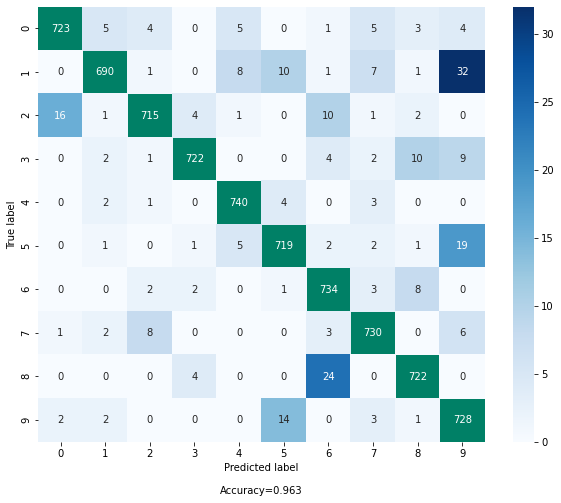

# Прогресс по научной работе
Дневник по научной работе у Дьяконова А.Г.

## 2020-2021 учебный год, осень

### Знакомство со звуком
Вначале я хотел понять, какие нейронные сети и как используют для классификации аудио.
Поэтому я начал с поиска статей на эту тему, и дальше читал релевантную информацию об аудио, чтобы разобраться в теме. Вот, что было найдено и изучено:

* Статья [1] ["Interpreting and Explaining Deep Neural Networks for Classification of Audio Signals"](https://arxiv.org/pdf/1807.03418v2.pdf).

  В статье рассказывается о том, как можно интерпретировать нейронные сети, которые предназначены для классификации аудиоданных. Для статьи авторы собрали датасет AudioMNIST (в котором записали, как люди произносят цифры от 0 до 9) и обучили на нем две различные архитектуры нейронных сетей для двух классификационных задач: определение произнесенных цифр и определение гендера спикера.

  Одна из архитектур по сути является сверточной нейронной сетью для классификации изображений (авторы использовали слегка измененную AlexNet), которой на вход подается спектрограмма для соответствующего аудиофайла. Вторая из архитектур (авторы назвали ее _AudioNet_) принимает на вход аудиосигнал в сыром (raw) виде и использует внутри себя сверточные слои, max pooling, активации ReLU и в конце полносвязные слои.

  Далее к каждой из архитектур применяется метод _Layer-wise relevance propagation (LRP)_ из статьи ["On Pixel-Wise Explanations for Non-Linear Classifier Decisions by Layer-Wise Relevance Propagation"](https://journals.plos.org/plosone/article?id=10.1371/journal.pone.0130140), который релевантности каждого из выходных нейронов на каждом слое распространяет назад к входным нейронам. В итоге получается, что можно релевантности на выходе нейронной сети распространить к входу всей нейронной сети и посмотреть на то, что во входном объекте действительно важно при классификации.

  Авторы статьи, анализируя LRP скоры, приходят к выводу, что для гендерной классификации достаточно довольно простых признаков из входного сигнала (достаточно признаков из низкочастотного диапазона), в то время как для классификации цифр нужны более сложные признаки. Также было сделано наблюдение, что AudioNet обращает больше всего внимание на отсчеты сигнала с наибольшей амплитудой. Также авторы проводят интересные эксперименты:
  1. Авторы скалируют мужские спектрограммы по оси частот в 1.5 раза, а женские в 0.66 раз, после чего подают такие сигналы на вход обученной AlexNet. В итоге нейронная сеть выдает долю правильных ответов (accuracy) 20%, что говорит о том, что действительно, для определения гендера достаточно простой информации о присутствующих на записи частотах, а сама AlexNet на такой измененной тестовой выборке хорошо предсказывает противоположный к настоящему гендер.
  2. Для AudioNet авторы зануляют входной сигнал в различные отсчеты времени тремя способами:
    1. Зануляют k% отсчетов сигнала в произвольные моменты времени;
    2. Зануляют k% отсчетов сигнала с наибольшей амплитудой;
    3. Зануляют k% отсчетов сигнала с наибольшими по модулю LRP скором.

    В итоге получается, что первая стратегия меньше всего влияет на точность AudioNet, в то время как 2 и 3 подходы почти одинаково сильно уменьшают точность модели. Делается вывод, что AudioNet обращает внимание на общую форму сигнала, а не на какие-то его отдельные части.

  Выводы:
  1. Существует простой датасет AudioMNIST, на котором можно обучать и разбираться с новыми моделями для работы со звуком (на нем скорее всего можно решать только задачи классификации).
  2. В нейронную сеть можно подавать как звук в сыром формате, так и его спектрограммы или  (тут, наверно, все звуковые дорожки должны быть одинаковой длительности).
  3. Скорее всего подход со спектрограммой работает лучше (в статье он показал точность на двух задачах 95.8% и 95.9%, в то время как подход AudioNet показал точность 92.5% и 91.7%).
  4. Существует подход _Layer-Wise Relevance Propagation_, с которым я познакомился высокоуровнево (не было цели разбираться именно с его деталями), и который по всей видимости можно применять для интерпретации почти любых нейронных сетей.
  5. Статья дает ссылки на другие полезные статьи, которые помогают понять, как в нейронную сеть можно подать звук (то, что мне пока что и нужно!).
  6. Авторы показали, что LRP действительно находит важные для классификации места во входном сигнале, но, правда, это несильно помогает интерпретировать решения нейронной сети (в случае определения гендера, конечно, помогает, но это все-таки простая задача).

* На этом этапе стало понятно, что нужно понять, что такое спектрограмма, Mel-спектрограмма.
  Для этого поискал материалы на эту тему, нашел и изучил следующее:
  * Про спектрограммы: https://en.wikipedia.org/wiki/Spectrogram
  * Про STFT: https://en.wikipedia.org/wiki/Short-time_Fourier_transform
  * Про преобразование Фурье знал, но освежил в памяти: https://ru.wikipedia.org/wiki/Преобразование_Фурье, https://ru.wikipedia.org/wiki/Быстрое_преобразование_Фурье
  * Про Mel шкалу: https://en.wikipedia.org/wiki/Mel_scale
  * Красивая и понятная визуализация преобразования Фурье от _3Blue1Brown_: https://www.youtube.com/watch?v=spUNpyF58BY
  * Простой пост про спектрограммы (с кодом): https://towardsdatascience.com/getting-to-know-the-mel-spectrogram-31bca3e2d9d0. Разбираться начал отсюда.

  В итоге разобрался с тем, как спектрограммы строятся.

  Параллельно нашел полезные библиотеки для работы со звуком:
  * `librosa` (https://librosa.org/doc/0.8.0/index.html) — библиотека для анализа музыки и аудио. В ней уже реализованы STFT (Short-time Fourier transform), Мел-фильтр, построение спектрограммы и мел-спектрограммы.

    Разобрался, почему в этой библиотеке при вызове `librosa.stft` возвращается только половина спектра. Цитата из [вики](https://ru.wikipedia.org/wiki/Дискретное_преобразование_Фурье#Формулы_преобразований):
    > Из последнего видно, что преобразование раскладывает сигнал на синусоидальные составляющие (которые называются гармониками) с частотами от N колебаний за период до одного колебания за период. Поскольку частота дискретизации сама по себе равна N отсчётов за период, то высокочастотные составляющие не могут быть корректно отображены — возникает [муаровый эффект](https://ru.wikipedia.org/wiki/Муаровый_узор). __Это приводит к тому, что вторая половина из N комплексных амплитуд, фактически, является зеркальным отображением первой и не несёт дополнительной информации__.

  * `audiomate` (https://audiomate.readthedocs.io/en/latest/index.html) — библиотека-интерфейс для аудио датасетов.

  Теперь все выглядит так (это один из подходов), что нужно просто для аудиодорожки построить ее Мел-спектрограмму и далее спектрограмму подавать сверточной нейронной сети для классификации изображений на вход. Попробуем его в будущем применить в соревновании [2]. Но для начала воспользуемся этим подходом для классификации цифр и гендера для датасета AudioMNIST. Код был написан на `pytorch`.

* Эксперименты над датасетом AudioMNIST

  Я попробовал научить модель разделять произнесенные цифры "0" и "1". Для этого я из датасета AudioMNIST оставил только эти цифры, далее все аудиодорожки перевел в мел-спектрограмму, после чего нормализовал (с помощью среднего и стандартного отклонения, посчитанных по обучающей выборке). Предварительно я еще определил продолжительность самой короткой аудиозаписи в датасете и все аудиофайлы сокращал до этой продолжительности. Для этого я просто вырезал центральную часть аудио нужной мне длины. Это мне нужно было для того, чтобы все спектрограммы были одинакового размера. Еще, я думаю, тут будет лучше не урезать длинные аудио, а наоборот короткие аудио дополнять до размера самой длинной, например, нулями. Также можно было бы разрезать все аудиофайлы на пересекающиеся куски одинаковой длины, их пропускать через СНС, а далее ответы по кускам усреднять (или брать максимум и т.п.).

  На этом этапе осталось выбрать сверточную нейронную сеть для классификации спектрограмм. Я недавно изучил статью [3] ["EfficientNet: Rethinking Model Scaling for Convolutional Neural Networks"](https://arxiv.org/pdf/1905.11946.pdf), в которой показывается, как можно эффективно скалировать сверточные нейронные сети для классификации изображений. Также в этой статье подобрали довольно маленькую, но при этом довольно точную бейзлайновую СНС EfficientNet-B0. Так как у меня не очень много данных для обучения, то я использовал именно ее.

  На этом этапе мне помогла библиотека `efficientnet_pytorch` (https://github.com/lukemelas/EfficientNet-PyTorch), в которой уже реализованы модели из статьи.

  Для обучения я использовал EfficientNet-B0 с 1 классом, оптимизатор Adam с параметрами по умолчанию, бинарную кроссэнтропию в качестве функции потерь, модель обучал 1 эпоху, размер батча 64, все 6000 аудио были разделены на 4500 аудио для обучения и 1500 аудио для теста. В итоге 20 итераций обучения хватило для достижения доли правильных ответов модели на обучающей выброрке в районе 1. После одной эпохи обучения доля правильных ответов на тестовой выборке равна 99.6%.

  Подробнее с результатами можно ознакомится в ноутбуке `audio_mnist.ipynb`.

  Попутно еще был найден предположительный баг в `pytorch`, из-за которого на валидации модель в режиме инференса (`model.eval()`) выдавала чушь, а модель в режиме обучения (`model.train()`) выдавала точные ответы. Люди уже сталкивались с подобным: https://discuss.pytorch.org/t/model-eval-gives-incorrect-loss-for-model-with-batchnorm-layers/7561. Поэтому я в своих экспериментах модель всегда использовал в режиме обучения. Из-за этого ответы модели могут отличаться от запуска к запуску, так как в EfficientNet-B0 есть дропаут слои.

  Далее я попробовал сделать то же самое, но теперь попробовал классифицировать все 10 цифр.
  Функция потерь теперь обычная кроссэнтропия, данных для обучения побольше в 5 раз, остальные параметры обучения не изменялись. В итоге за 1 эпоху обучения модель достигла доли правильных ответов на тесте 96.3%, что примерно повторяет результаты, полученные в статье [1]. Если посмотреть на матрицу соответствий, то видно, что модель сильнее всего путает 1 и 5 с 9, 8 с 6, 2 с 0 и 9 с 5. 9 и 5 действительно по-английски произносятся похоже, к тому же в выборке большинство говорящих имеют различные акценты, что могло повлиять на качество предсказаний.

  

  Еще я попробовал обученной моделью классифицировать цифры, произнесенные мною. Я записал по 1 аудио на каждую из цифр, в итоге модель правильно угадала 7 цифр из 10. При этом для неправильно классифицированные цифры модель выдала сомневающийся ответ (скоры для классов не были уверенными). Например, для цифры "3" модель предсказала 1% вероятности для "0", 1% для "2", 41% для "3" и 57% для "9". Таким образом можно сделать вывод, что модель вряд ли переобучилась, хотя явно у нас количество параметров модели превосходит количество примеров в обучающей выборке.

  Выводы:
  * Датасет AudioMNIST подходит для того, чтобы поиграться
  * Мел-спектрограммы + сверточная нейронная сеть хорошо себя показали в модельной задаче по классификации произнесенных цифр.
  * EfficientNet можно применять и при работе со звуком.

* Статья [4] ["CNN Architectures for Large-scale Audio Classification"](https://arxiv.org/pdf/1609.09430v2.pdf) (у статьи много цитирований).

  В статье авторы рассказывают, как они решали задачу классификации аудио с большим числом таргетов. У них был собран огромный датасет из 100 миллионов записей (суммарная продолжительность всех записей — 5.24 миллиона часов), каждая запись помечена несколькими из 30 871 меток (в среднем 5 меток на видео). Такой большой датасет защищает от переобучения, но при этом делает обучение довольно долгим процессом (у авторов ушло на обучение лучшей модели почти 2 недели при обучении на кластере из 20 GPU). Для решения такой задачи авторы разбивали все аудиодорожки на пересекающиеся отрезки по 960 мс, для каждого из отрезков строили мел-спектрограмму, которую впоследствии классифицировали с помощью СНС, после чего результаты от всех отрезков усреднялись. Таким образом делалось предсказание для одной аудиозаписи.

  В качестве СНС авторы попробовали AlexNet, VGG, Inception V3, ResNet-50. В качестве бейзлайна авторы использовали полносвязную НС. В результате авторы приходят к выводу, что СНС хорошо подходят для решения задачи классификации аудио.

  Тут стоит еще сказать о том, что метки для обучающей и валидационной выборок авторы собирали также с помощью методов машинного обучения, так что в целом обученные модели могли бы быть при точной разметке выборок по качеству хуже или лучше, чем то, что получилось у авторов.

  Выводы:
  * Подход мел-спектрограмма + СНС хороший
  * При маленькой обучающей выборке может быть переобучение, надо об этом помнить

* Что еще тут можно изучить
  - [ ] Посмотреть, какие еще представления для звуковых данных бывают, отличных от "сырого" формата, спектрограмм.
  - [ ] Поискать, использовали ли до меня EfficientNet для классификации аудио и какие результаты получились.

Полезные найденные ссылки:
1. https://github.com/soerenab/AudioMNIST — датасет AudioMNIST и код из статьи [1]. Думаю, его буду использовать в своих первых экспериментах.
2. https://github.com/jim-schwoebel/voice_datasets — большой список датасетов с аудиоданными.
3. https://github.com/ynop/audiomate — библиотека для быстрого доступа к аудиодатасетам. Полный список доступных датасетов: https://audiomate.readthedocs.io/en/latest/reference/io.html. Библиотека понадобилась, так как AudioMNIST очень долго скачивается из изначального репозитория, так как авторы зачем-то залили в него 30 000 файлов без сжатия их в один архив. Поэтому 2Гб данных приходится качать на скорости 100Кб/сек, что означает, что загрузка будет длиться 5-6 часов.

### Соревнование "Rainforest Connection Species Audio Detection" [2]
На кегле я как раз нашел соревнование по классификации аудио: [Rainforest Connection Species Audio Detection](https://www.kaggle.com/c/rfcx-species-audio-detection/overview).

Я просмотрел открытые ноутбуки в этом соревновании, там используют подход с мел-спектрограммой + СНС. Также часто используется библиотека `librosa`. Попробую поучаствовать в этом соревновании, думаю, это даст мне некоторый опыт в работе со звуком.

Также заметил, что в соревновании 15Гб данных для обучения и 24 метки. Также, как я понимаю, важно будет в этом соревновании правильно аугментировать данные.

Еще пока что не очень понял, как в решении можно применить информацию о false positives, надо об этом будет подумать...

### ASR (Automatic Speech Recognition) и TTS (Text To Speech)

Также мне интересно узнать, как устроены технологии по распознаванию и синтезу речи.

- [ ] Прочитать про то, как обычно решают задачу ASR
- [ ] Прочитать про то, как обычно решают задачу TTS
- [ ] Попробовать реализовать простейшие модели для ASR, TTS

### Ссылки из текста
[1] [Статья "Interpreting and Explaining Deep Neural Networks for Classification of Audio Signals"](https://arxiv.org/pdf/1807.03418v2.pdf)  
[2] [Соревнование "Rainforest Connection Species Audio Detection"](https://www.kaggle.com/c/rfcx-species-audio-detection/overview)  
[3] [Статья "EfficientNet: Rethinking Model Scaling for Convolutional Neural Networks"](https://arxiv.org/pdf/1905.11946.pdf)  
[4] [Статья "CNN Architectures for Large-scale Audio Classification"](https://arxiv.org/pdf/1609.09430v2.pdf)

### Примечания
+ Сейчас дневник находится в процессе заполнения и выявления оптимального способа его написания. Поэтому текст может быть не очень последовательным.

<!-- Мусорка из комментов -->
<!-- # CHECK TODO! -->
<!-- ### Звук -->
<!--  -->
